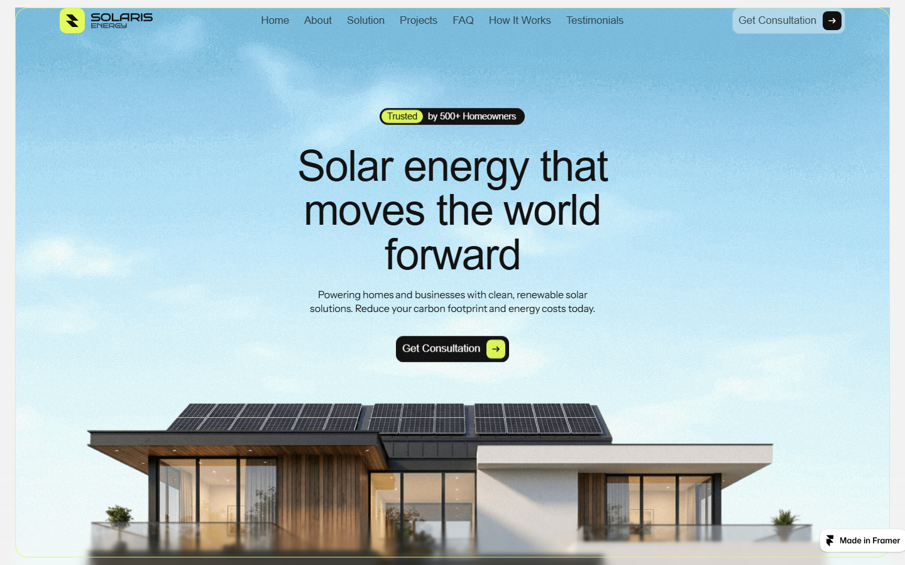

# Zentric Energy ⚡

**Smart Solar Solutions for Homes**



A fully client-side marketing site for a residential solar company — originally built in [Framer](https://framer.com), exported, and localized to run **100% offline** with zero external requests.

## Highlights

- ⛅ **Fully self-contained** — all fonts, images, search indexes and the Lenis smooth-scroll CSS are served locally. The site renders with the internet unplugged.
- ⚛️ **Framer React runtime** — the original compiled React bundles hydrate the static HTML (animations, carousels, FAQ accordions, search) exactly as on the hosted version.
- 🟡 **Brand refresh** — rebranded from Solaris → Zentric across HTML, compiled chunks, metadata and contact details.
- 🖼️ **Real project photos** — the hero carousel uses actual installation photography.
- 🧭 **Extended nav** — extra section links (How It Works, Testimonials, FAQ, Contact) injected after React hydration, so they never conflict with it.

## Pages

| Page | Path |
|---|---|
| Home | `index.html` |
| Contact | `contact.html` |

## Run it

Any static file server pointed at this folder works. Two options:

```bash
# Option 1: Node (zero deps)
npx serve .

# Option 2: the bundled server
node serve.js
```

Or just drop the folder into XAMPP's `htdocs` (e.g. `htdocs/Zentric`) and open
`http://localhost/Zentric/`.

> **Note:** serving from a subfolder is fully supported — all asset references are relative.

## Tech notes

- Built with [Framer](https://framer.com) (design + SSR export)
- React 18 hydration via the Framer runtime (`scripts/vendor/`)
- Lenis smooth scrolling, Framer Motion animations
- Fonts: Geist + Host Grotesk (self-hosted WOFF2)
- No build step required — it's plain static files

---

© 2025 Zentric Energy. All rights reserved.
